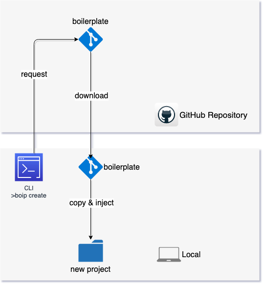
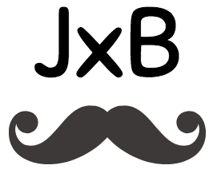
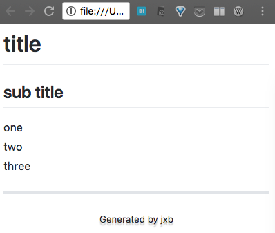

# mick-whats images

  [](https://app.netlify.com/sites/sad-nobel-60023c/deploys)


  ## boip/tutorial01.png

### image

---



---

### code

```


# path

https://mick-whats-images.netlify.com/boip/tutorial01.png

# html

<a href="https://mick-whats-images.netlify.com/boip/tutorial01.png">boip/tutorial01.png</a>

# markdown

[boip/tutorial01.png](https://mick-whats-images.netlify.com/boip/tutorial01.png)

```

### link

[boip/tutorial01.png](https://mick-whats-images.netlify.com/boip/tutorial01.png)

---

## jxb/jxb_logo.png

### image

---



---

### code

```


# path

https://mick-whats-images.netlify.com/jxb/jxb_logo.png

# html

<a href="https://mick-whats-images.netlify.com/jxb/jxb_logo.png">jxb/jxb_logo.png</a>

# markdown

[jxb/jxb_logo.png](https://mick-whats-images.netlify.com/jxb/jxb_logo.png)

```

### link

[jxb/jxb_logo.png](https://mick-whats-images.netlify.com/jxb/jxb_logo.png)

---

## jxb/jxb_ss_01.png

### image

---



---

### code

```


# path

https://mick-whats-images.netlify.com/jxb/jxb_ss_01.png

# html

<a href="https://mick-whats-images.netlify.com/jxb/jxb_ss_01.png">jxb/jxb_ss_01.png</a>

# markdown

[jxb/jxb_ss_01.png](https://mick-whats-images.netlify.com/jxb/jxb_ss_01.png)

```

### link

[jxb/jxb_ss_01.png](https://mick-whats-images.netlify.com/jxb/jxb_ss_01.png)

---

